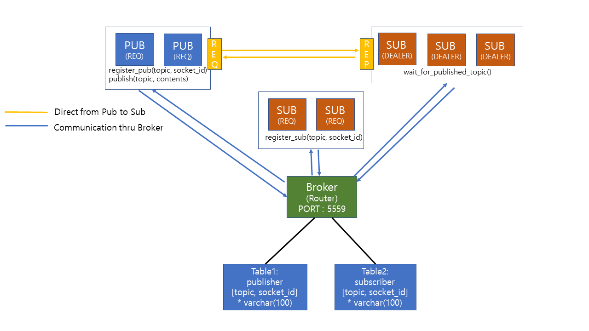

# 2020 Distributed Systems : Assignment1 - Vanderbilt University

# System Diagram

# How to Execute
0. Prerequirement
 - Mysql Database
  - user information : ID - lhh@localhost, PW -1234
  - Database Name : pubsub
  - Table Information
     publisher(topic varchar(100), socket_id varchar(100))
     subscriber(topic varchar(100), socket_id varchar(100))

1. Publisher to Subscriber using Broker(3 Subscriber and 1 Publisher)
 - $ python broker.py
 - $ python sub.py 1
 - $ python sub.py 1
 - $ python sub.py 1
 - $ python pub.py 1

2. Directly from Publisher to Subscriber(3 Subscriber and 1 Publisher)
 - $ python broker.py
 - $ python sub.py D
 - $ python sub.py D
 - $ python sub.py D
 - $ python pub.py D
