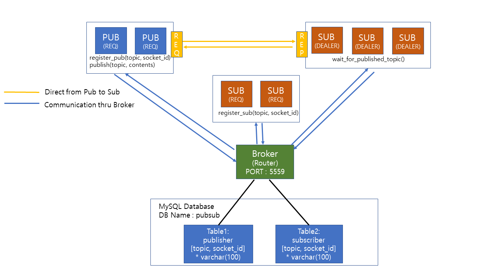

**Vanderbilt University**

**2020 Distributed Systems Principles(CS6381) Assignment1 : Pub/Sub Model Implementation using ZeroMQ**

## System Diagram

## How to Execute
**0. Prerequirement**
 - Mysql Database
  - user information : ID - 'lhh@localhost', PW - '1234'
  - Database Name : pubsub
  - Table Information
     publisher(topic varchar(100), socket_id varchar(100))
        -- create table publisher(topic varchar(100), socket_id varchar(100));
     subscriber(topic varchar(100), socket_id varchar(100))
        -- create table subscriber(topic varchar(100), socket_id varchar(100));

**1. Publisher to Subscribers using Broker (i.e. 3 Subscriber and 1 Publisher)**
* broker's IP address and Port number are required
 - $ python broker.py
 - $ python sub.py 1 127.0.1.1 5559 N
 - $ python sub.py 1 127.0.1.1 5559 N
 - $ python sub.py 1 127.0.1.1 5559 N
 - $ python pub.py 1 127.0.1.1 5559 N

**2. Directly from Publisher to Subscribers (i.e. 3 Subscriber and 1 Publisher)**
* broker's IP address and Port number are required
 - $ python broker.py
 - $ python sub.py D 127.0.1.1 5559 N
 - $ python sub.py D 127.0.1.1 5559 N
 - $ python sub.py D 127.0.1.1 5559 N
 - $ python pub.py D 127.0.1.1 5559 N
